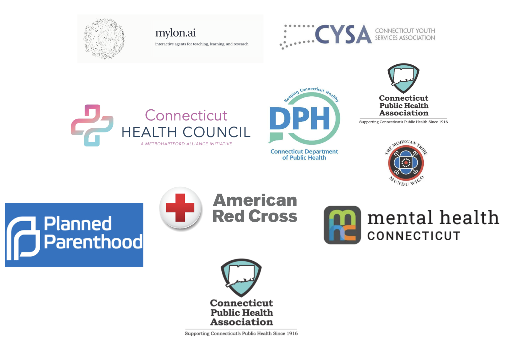

# Yale Healthcare Consulting Collective

**Student-led consulting for healthcare organizations — built at Yale, driven by impact.**

YHCC is a [Dwight Hall at Yale](https://dwighthall.org) member organization. We connect Yale students across medicine, public health, engineering, and policy with healthcare institutions facing real strategic challenges. Our teams deliver rigorous, actionable analysis — pro bono.

> 🌐 **Live site:** [sofiagrimm.github.io/yale-healthcare-consulting](https://sofiagrimm.github.io/yale-healthcare-consulting)

---

## What We Do

YHCC pairs interdisciplinary student teams with healthcare clients — hospitals, nonprofits, and health systems — on high-stakes consulting engagements. Projects span:

- **Operations & Strategy** — workflow redesign, capacity planning, resource allocation
- **Data & Analytics** — decision-support tools, fleet modeling, outcomes analysis
- **Policy & Market Research** — landscape analyses, regulatory review, go-to-market strategy
- **Technology & Digital Health** — product scoping, vendor evaluation, platform strategy

---

## Recent Clients



Past and current engagements include organizations across the nonprofit health, hospital operations, and medical services sectors.

---

## After YHCC

YHCC alumni go on to careers in medicine, healthcare consulting, public health policy, and biomedical research — at institutions including top medical schools, McKinsey Health, BCG, and major academic medical centers. The skills built here — structured problem-solving, client communication, data-driven analysis — translate directly to every path in healthcare.

---

## This Repository

This repo contains the **official YHCC website**, built by students and deployed on GitHub Pages. It is a TypeScript + React application using Vite, Tailwind CSS, and Framer Motion.

### Stack

| Layer | Technology |
|---|---|
| Framework | React 18 + TypeScript |
| Build tool | Vite |
| Styling | Tailwind CSS |
| Routing | react-router v7 (Data Router) |
| Animations | motion/react (Framer Motion) |
| Icons | lucide-react |
| Carousel | react-slick |
| Deployment | GitHub Pages + Vercel (SPA rewrites) |

### Local Development

```bash
npm install
npm run dev
```

### Build & Deploy

```bash
npm run build   # output → dist/
```

Deployed on Vercel with SPA rewrites configured in `vercel.json`. GitHub Pages deployment enabled via `.nojekyll`.

### Project Structure

```
src/
  components/
    animations/     FadeIn, StaggerContainer, StaggerItem
    layout/         Header, Footer
  pages/            Home, About, Services, Team, Contact
  routes.tsx        react-router createBrowserRouter config
  Root.tsx          Layout shell with Header + Footer + Outlet
  main.tsx          Entry point
  index.css         Tailwind base styles
```

---

## Get Involved

**For students:** Applications open each semester. We recruit Yale undergraduates and graduate students across all majors.

**For organizations:** We welcome inquiries from nonprofits, health systems, and healthcare startups seeking pro bono consulting support.

📧 [yhcc@dwighthall.org](mailto:yhcc@dwighthall.org) · 💼 [LinkedIn](https://www.linkedin.com/company/yale-healthcare-consulting-collective)
